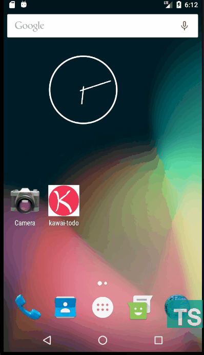

# [Kawai Todo](https://github.com/qvil/kawai-todo)

Kawai To Do App made with React Native (Thanks to Nicolás)

## Demo

## Install & Start

* Demo : https://expo.io/@qvil/kawai-todo
* Download : https://www.dropbox.com/s/oneaipyrl97cyuv/kawai-todo-4b8f9db9-534b-11e8-8146-0a580a7820c7-signed.apk?dl=0

### Demo QR Code

Scan this QR code with your Expo mobile app to load the project immediately.

## Reference

https://www.youtube.com/watch?v=zG7328Qm0LQ&list=PL7jH19IHhOLOefIzCSQ03xlBekyi81FVv

## [License](https://github.com/qvil/kawai-todo/blob/master/LICENSE)

MIT
